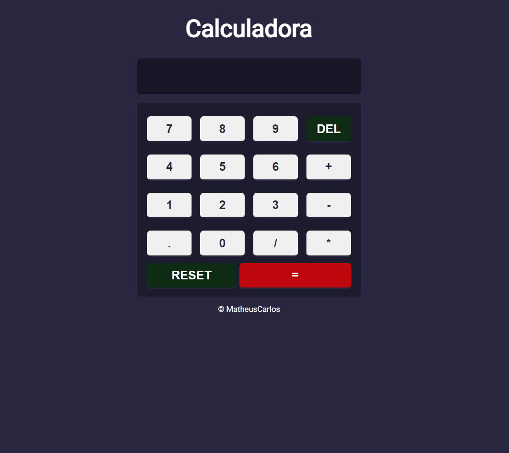

# CALCULADORA 

> CALCULADORA SIMPLES

Projeto construído para praticar conceitos de FrontEnd. Utilizando a função eval() do JavaScript para fazer as operações aritméticas e if/else para suas condições.

[Clique aqui para acessar](https://matheuscarlosf.github.io/calculadora/)

## Tecnologias
- HTML
- CSS
- JavaScript
- Git e Github

## Contato

matheuscarlos16@hotmail.com